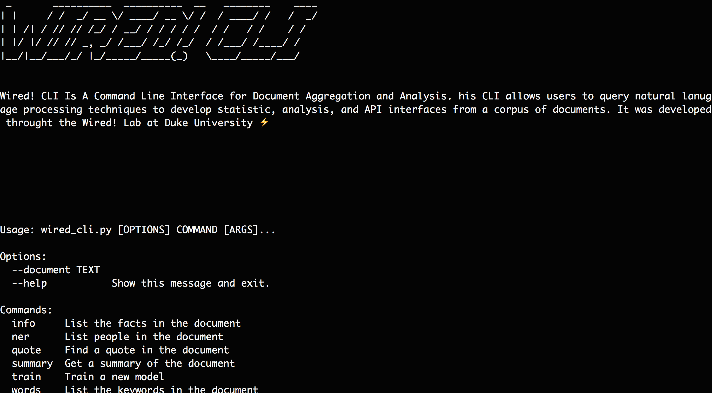

# WiredCLI
> A Command Line Interface for Document Aggregation and Analysis


This is a CLI for Document aggregation and analysis. This CLI allows users to query natural lanugage processing techniques to develop statistic, analysis, and API interfaces from a corpus of documents. It was developed throught the [Wired!](http://www.dukewired.org/) Lab at Duke University



## Installation

OS X & Linux:

```sh
pip install wired_cli
```

## Development

OS X & Linux:

```sh
python wired_cli.py --help
```


## Usage example: Here are the questions one can answer with WiredCLI

### What documents are like this document?
### What are keywords from this document?
### What is a summary of this document?
### What documents are like this topic?
### What is the answer to this question about said documents?
### What are the facts from this document?
### What are the facts from this group of document?
### How polarized is this document?

_For more examples and usage, please refer to the [Wiki][wiki]._

## Release History

* 0.0.1
    * Work in progress

## Meta

Matthew Kenney– [@matthewbay](https://twitter.com/matthewbay) – mk365@duke.edu

[https://github.com/dukewired/wired_cli](https://github.com/dukewired/wired_cli)

## Contributing

1. Fork it (<https://github.com/dukewired/wired_cli/fork>)
2. Create your feature branch (`git checkout -b feature/fooBar`)
3. Commit your changes (`git commit -am 'Add some fooBar'`)
4. Push to the branch (`git push origin feature/fooBar`)
5. Create a new Pull Request